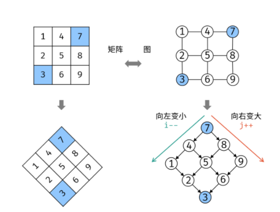

# 写在开始之前
1.  养成边界检查的习惯，先判断边界条件，有时边界情况不止一种
2.  定下思考方向，搭好框架，再完善实现细节

# 链表
## 反转链表
### 1. 简单从头到尾反转链表:（题206）
```java
// 头指针head
class Solution {  // 非递归
	public ListNode reverseList(ListNode head) {
        if(head==null || head.next==null) return head;   // 处理边界条件
        ListNode pre;
        ListNode back;
        ListNode tmp;
        back = head;
        pre = back.next;
        while(pre!=null){
            tmp = pre.next;
            pre.next = back;
            back = pre;
            pre = tmp;
	    }
        head.next=null;
        return back;
    }
}
```
```java
class Solution {  // 递归
    public ListNode reverseList(ListNode head) {
        if (head == null || head.next == null) {
            return head;
        }
        ListNode revHead = reverseList(head.next);
        head.next.next = head;
        head.next = null;
        return revHead;
    }
}
```

### 2. 区间反转：哑节点处理边界情况（题92）
```java
class Solution {

	public void reverseList(ListNode head) {  // 反转链表方法
		if(head==null || head.next==null) return;  // 处理边界条件
		ListNode pre;
		ListNode back;
		ListNode tmp;
		back = head;
		pre = back.next;
        while(pre!=null){
	    	tmp = pre.next;
	    	pre.next = back;
	    	back = pre;
	    	pre = tmp;
	    }
	    head.next=null;
    }

	public ListNode reverseBetween(ListNode head, int left, int right) {
		if(head==null || head.next==null || left==right) return head;
		ListNode dummyNode = new ListNode(-1);  // 添加一个哑节点（相当于空的头结点）
		dummyNode.next = head;
		// 找需要记录的位置
		ListNode startBefore = dummyNode; // 添加了哑节点之后才能这样赋初值
		ListNode start = head;
		ListNode end = start;
		ListNode endNext = end.next;
        int i = 1;
		while(i<right){   // 找四个应该保存的节点
			if(i<left){ // 找start
				start = start.next;
				startBefore = startBefore.next;
			}
			end = end.next;    // 找end
			endNext = endNext.next;
			i++;
        }
		end.next = null; //断开

		// 反转中段链
        reverseList(start);
		startBefore.next = end;
		start.next = endNext;
		return dummyNode.next;
	}
}
```

### 3. 两个一组反转链表，难点：就地反转，组内反转而组间顺序不变（题24）
```java
class Solution {      // 循环
    public ListNode swapPairs(ListNode head) {
        if (head==null || head.next==null) return head; // 处理边界条件
        ListNode node1 = head;  // 总是记录待反转的两个节点
        ListNode node2 = head.next ;
        node1.next = node2.next;
        node2.next = node1;
        head = node2;
        while(node1.next!=null && node1.next.next!=null){    // 能找到一个新的组
            ListNode tmp = node1;
            // 移动
            node1 = node1.next;
            node2 = node1.next;
            // 翻转链接
            node1.next = node2.next;
            node2.next = node1;
            tmp.next = node2;
        }
        return head;
    }
}
```
```java
class Solution {      // 递归写法
    public ListNode swapPairs(ListNode head) {
        if(head == null || head.next == null)
            return head;
        ListNode node1 = head;
        ListNode node2 = head.next;
        node1.next = swapPairs(node2.next);
        node2.next = node1;
        return node2;
    }
}
```
### 4. k个一组反转链表（题25）
- 递归思路：
	1. 边界条件：判断是否够一组，如果不够一组直接return
	2. 够一组的话处理当前组的反转
	3. 把后面的结果链接上，然后返回最终结果
```java
class Solution {
    public ListNode reverseKGroup(ListNode head, int k) {
        // 递归思路，先反转本组，然后把后面的递归结果连接上，如果不成一组就不反转了
        ListNode tmp = head;
        // 成组才反转否则直接返回head
        for(int i=0; i<k; i++){
            if(tmp==null) return head;
            tmp = tmp.next;
        }
        // 反转本组
        ListNode pre = head;
        ListNode back = null;
        for(int i=0; i<k; i++){
            tmp = pre.next;
            pre.next = back;
            back = pre;
            pre = tmp;
        }
        head.next = reverseKGroup(pre,k);
        return back;
    }
}
```
- 非递归解法：
  - 非递归解法要考虑得多一点因为要记录上一组的末尾结点，所以引入哑结点，这样比较好处理初始情况。因为要返回的是第一组反转后的头指针，而第一组够k个和不够k个返回头指针的情况是不一样的，所以把第一组不够k个也作为一种边界条件来单独处理。
  - 循环部分的步骤：
    1. 进入循环的条件：本组存在，也就是组头指针不为空
    2. 进入循环后，先判断本组够不够k个，不够k个不需要反转，并且说明本组是最后一组了，可以return了
    3. 如果本组够k个：反转本组，把本组链上，更新标记指针
    4. 进入下一轮循环
```java
class Solution {
    public ListNode reverseKGroup(ListNode head, int k) {
        // 边界情况，不反转
        if(k==0) return head;
        // 边界情况：第一组不够k个
        ListNode p = head;
        for(int i=0; i<k; i++){
            if(p==null) return head;
            p = p.next;
        }
        // 其他一般情况：第一组够k个
        ListNode dummyNode = new ListNode();   // 添加一个哑结点
        dummyNode.next = head;
        ListNode lastGroupTail = dummyNode;   // 上一组的尾巴
        ListNode groupHead = head;  // 记录组头
        for(int i=0; i<k-1; i++){
            head = head.next;
        }  // 把head移到正确的位置
        while(groupHead != null ){     // 如果还有一组
            ListNode tmp = groupHead;
            for(int i=0; i<k; i++){      // 看是否够一组
                // 不够k个的话说明本轮是最后一组了，此时groupHead不会变
                if(tmp==null) return dummyNode.next;
                tmp = tmp.next;
            }
            // 如果够一组了，反转本组
            ListNode pre = groupHead;
            ListNode back = null;
            for(int i=0; i<k; i++){
                ListNode temp = pre.next;
                pre.next = back;
                back = pre;
                pre = temp;
            }
            // 将本组链上
            groupHead.next = pre;
            lastGroupTail.next = back;
            // 更新
            lastGroupTail = groupHead;
            groupHead = pre;
        }
        return head;
    }
}
```

## 环形链表
### 1. 检测链表形成环（题141）
- 思路1：将结点保存在不允许保存重复元素的集合中，利用内存地址对结点进行判重
- 思路2：快慢指针，慢指针一次走一步，快指针一次走两步，如果两指针相遇，就说明形成环
  - 快慢指针相遇就说明形成环？
  - 如果有环，两指针最终都会走到环里，并且快指针走得快，类似相遇问题，所以两指针最终会相遇
  - 如果没有环，慢指针永远不会遇到快指针
```java
public class Solution {          // 思路1：快慢指针
    public boolean hasCycle(ListNode head) {
        ListNode fast = head;
        ListNode slow = head;
        while(fast!=null && fast.next!=null){      // 如果尾部有空指针，说明无环
            slow = slow.next;     // 初始状态是无环的
            fast = fast.next.next;
            if(fast==slow) return true;
        }
        return false;
    }
}
```
```java
import java.util.HashSet;        // 思路2：导入不可装入重复元素的集合
public class Solution {
    public boolean hasCycle(ListNode head) {
       HashSet<ListNode> nodeArr = new HashSet<ListNode>();    // 创建一个空集合
       while(head!=null){
           if(nodeArr.contains(head)) return true;
           nodeArr.add(head);
           head = head.next;
       }
       return false;
    }
}
```
### 2. 如何找到环的起点（题142）
在设置快慢指针的基础上，看作数学问题：
- 
- 从而得到解决步骤：
  - 设置快慢指针，让快慢指针相遇
  - 设置新指针指向起点
  - 让慢指针和新指针同时前移，慢指针和新指针相遇的位置就是环的起点
```java
public class Solution {
    public ListNode detectCycle(ListNode head) {
        ListNode slow = head;
        ListNode fast = head;
        while(fast!=null && fast.next!=null){  // 是否有环，如果跳出此循环说明无环，返回null
            fast = fast.next.next;
            slow = slow.next;
            if(fast==slow){     // 快慢指针相遇说明有环
                ListNode tmp = head;     // 设置新指针
                while(tmp!=slow){        // 新指针和慢指针同时前移，相遇处就是环的起点
                    tmp = tmp.next;
                    slow = slow.next;
                }
                return tmp;
            }
        }
        return null;
    }
}
```

## 链表合并
### 1. 合并两个有序链表（题21）
- 递归解法：返回条件，有一个链表已经遍历完了，否则挑出一个最小的head，递归剩下的
```java
class Solution {
    public ListNode mergeTwoLists(ListNode list1, ListNode list2) {
        if(list1==null) return list2;
        if(list2==null) return list1;
        if(list1.val<list2.val) {
            list1.next = mergeTwoLists(list1.next,list2);
            return list1;
        } else {
            list2.next = mergeTwoLists(list1,list2.next);
            return list2;
        }
    }
}
```
- 非递归解法：经典merge，就是归并排序里的合并算法
```java
class Solution {
    public ListNode mergeTwoLists(ListNode list1, ListNode list2) {
        if(list1==null) return list2;
        if(list2==null) return list1;
        ListNode dummyNode = new ListNode();         // 添加哑结点
        ListNode p = dummyNode;
        while(list1!=null && list2!=null){
            if(list1.val<list2.val){
                p.next = list1;
                p = p.next;
                list1 = list1.next;
            } else {
                p.next = list2;
                p = p.next;
                list2 = list2.next;
            }
        }
        if(list1==null) p.next = list2;       // 后处理
        if(list2==null) p.next = list1;
        return dummyNode.next;
    }
}
```

### 2. 合并k个有序链表（题23）
- 思路：二路归并的循环实现和递归实现
- 思路一：循环二路归并
```java
class Solution {
    public ListNode mergeTwo(ListNode list1, ListNode list2){ // 合并两个链表
        if(list1==null) return list2;
        if(list2==null) return list1;
        if(list1.val<list2.val){
            list1.next = mergeTwo(list1.next,list2);
            return list1;
        } else {
            list2.next = mergeTwo(list1,list2.next);
            return list2;
        }
    }
    public ListNode mergeKLists(ListNode[] lists) {
        if(lists.length==0) return null;  // 没有链表
        if(lists.length==1) return lists[0];  // 只有一个链表
        // 2路并归合并
        for(int size=1; size<=lists.length; size*=2){  // 归并趟数，size是当次步长
            for(int i=0; i<lists.length; i+=2*size){  // 循环处理每一组
                if(i+size<lists.length){
                    lists[i] = mergeTwo(lists[i],lists[i+size]);
                }
            }
        }
        return lists[0];
    }
}
```
- 思路2：递归二路归并
```java
class Solution {
    public ListNode mergeTwo(ListNode list1, ListNode list2){ // 合并两个链表
        if(list1==null) return list2;
        if(list2==null) return list1;
        if(list1.val<list2.val){
            list1.next = mergeTwo(list1.next,list2);
            return list1;
        } else {
            list2.next = mergeTwo(list1,list2.next);
            return list2;
        }
    }
    public ListNode _mergeKLists(ListNode[] lists, int start, int end) { // 分别是头尾索引
        if(lists.length==0) return null;  // 没有链表
        if(start==end) return lists[start];  // 只剩一个
        if(start+1==end) return mergeTwo(lists[start], lists[end]);  // 两个的时候返回
        // 分治
        int mid = (int)Math.ceil((double)(start+end)/2);
        ListNode left = _mergeKLists(lists, start, mid);
        ListNode right = _mergeKLists(lists, mid+1, end);
        return mergeTwo(left, right);
    }
    public ListNode mergeKLists(ListNode[] lists) {
        return _mergeKLists(lists, 0, lists.length-1);
    }
}
```

## 求链表中间结点（题234）
### 1. 判断回文链表
- 思路：反转链表后半段，再和前半段一一比较
- 关键：找中点，用快慢指针。（这里边界的验证很好想，自己举一个奇数个结点的例子和一个偶数个结点的例子即可）
```java
class Solution {

    public ListNode reverseList(ListNode head){  // 反转链表
        if(head==null || head.next==null) return head;
        ListNode back = null;
        ListNode pre = head;
        while(pre!=null){
            ListNode tmp = pre.next;
            pre.next = back;
            back = pre;
            pre = tmp;
        }
        return back;
    }

    public boolean isValEqual(ListNode list1, ListNode list2){ // 以更短的链表为准，判断结点值是否逐个相等
        while(list2!=null){  // 以后半段的长度为准
            if(list1.val!=list2.val) return false;
            list1 = list1.next;
            list2 = list2.next;
        }
        return true;
    }

    public boolean isPalindrome(ListNode head) {
        if(head.next==null) return true;
        ListNode slow = head; // 找中点，快慢指针
        ListNode fast = head.next;
        while(fast!=null && fast.next!=null){
            fast = fast.next.next;
            slow = slow.next;   
        }
        // 奇数时slow会停在中点一个位置，此时fast==null
        // 偶数时slow会停前半段的最后一个位置，此时fast!=null
        // 可以通过fast的状态来判断此时slow是什么状态
        // 但是没有必要因为此时后半段head一定是slow.next
        ListNode headTmp = reverseList(slow.next);
        return isValEqual(head, headTmp);   // 这里后半段的头部是headTmp，以这个长度为准
    }
}
```

# 栈和队列

1.  辅助栈（题155：O(1)找min）

# 堆

# 字符串

# 递归

# 查找

1.  注意利用序列的有序性
2.  矩阵转化为二叉树：在一个 n \* m 的二维数组中，每一行都按照从左到右递增的顺序排序，每一列都按照从上到下递增的顺序排序。请完成一个高效的函数，输入这样的一个二维数组和一个整数，判断数组中是否含有该整数。
- 
- 旋转，视为一棵二叉排序树

# 哈希

# 贪心

# 动态规划

# 遇到的一些小问题

1.  java的条件判断是短路式判断，下面两种写法的区别在于：条件判断会从左往右判断，如果先判断：nums[right]>target，这一句，有可能发生数组下标越界，但是把right>=0放在左边先判断的话，如果不满足这个要求，在短路式判断下整个与表达式就会被判错，后半句就不会参与判断，就不会发生数组下标越界了。

```java
while(right>=0 && nums[right]>target) right--;
while(nums[right]>target && right>=0) right--;
```

