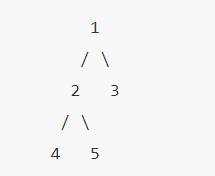
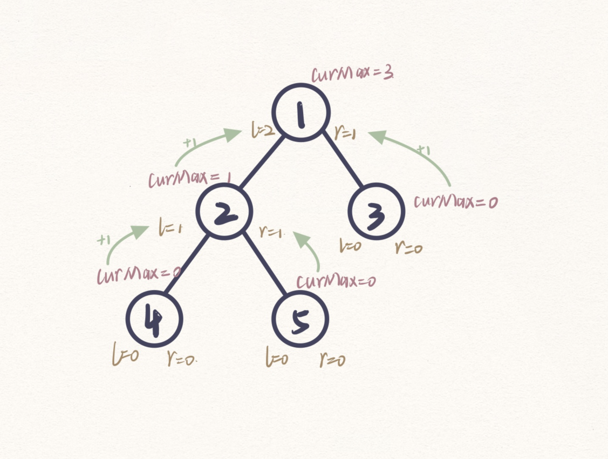

# 写在开始之前
1.  养成边界检查的习惯，先判断边界条件，有时边界情况不止一种
2.  定下思考方向，搭好框架，再完善实现细节

# 链表
## 反转链表
### 1. 简单从头到尾反转链表:（题206）
```java
// 头指针head
class Solution {  // 非递归
	public ListNode reverseList(ListNode head) {
        if(head==null || head.next==null) return head;   // 处理边界条件
        ListNode pre;
        ListNode back;
        ListNode tmp;
        back = head;
        pre = back.next;
        while(pre!=null){
            tmp = pre.next;
            pre.next = back;
            back = pre;
            pre = tmp;
	    }
        head.next=null;
        return back;
    }
}
```
```java
class Solution {  // 递归
    public ListNode reverseList(ListNode head) {
        if (head == null || head.next == null) {
            return head;
        }
        ListNode revHead = reverseList(head.next);
        head.next.next = head;
        head.next = null;
        return revHead;
    }
}
```

### 2. 区间反转：哑节点处理边界情况（题92）
```java
class Solution {
    public void reverseList(ListNode head) {  // 反转链表方法
        if(head==null || head.next==null) return;  // 处理边界条件
        ListNode pre;
        ListNode back;
        ListNode tmp;
        back = head;
        pre = back.next;
        while(pre!=null){
            tmp = pre.next;
            pre.next = back;
            back = pre;
            pre = tmp;
        }
        head.next=null;
    }

    public ListNode reverseBetween(ListNode head, int left, int right) {
        if(head==null || head.next==null || left==right) return head;
        ListNode dummyNode = new ListNode(-1);  // 添加一个哑节点（相当于空的头结点）
        dummyNode.next = head;
        // 找需要记录的位置
        ListNode startBefore = dummyNode; // 添加了哑节点之后才能这样赋初值
        ListNode start = head;
        ListNode end = start;
        ListNode endNext = end.next;
        int i = 1;
        while(i<right){   // 找四个应该保存的节点
            if(i<left){   // 找start
                start = start.next;
                startBefore = startBefore.next;
            }
            end = end.next;    // 找end
            endNext = endNext.next;
            i++;
        }
        end.next = null; //断开
        // 反转中段链
        reverseList(start);
        startBefore.next = end;
        start.next = endNext;
        return dummyNode.next;
    }
}
```

### 3. 两个一组反转链表，难点：就地反转，组内反转而组间顺序不变（题24）
```java
class Solution {      // 循环
    public ListNode swapPairs(ListNode head) {
        if (head==null || head.next==null) return head; // 处理边界条件
        ListNode node1 = head;  // 总是记录待反转的两个节点
        ListNode node2 = head.next ;
        node1.next = node2.next;
        node2.next = node1;
        head = node2;
        while(node1.next!=null && node1.next.next!=null){    // 能找到一个新的组
            ListNode tmp = node1;
            // 移动
            node1 = node1.next;
            node2 = node1.next;
            // 翻转链接
            node1.next = node2.next;
            node2.next = node1;
            tmp.next = node2;
        }
        return head;
    }
}
```
```java
class Solution {      // 递归写法
    public ListNode swapPairs(ListNode head) {
        if(head == null || head.next == null)
            return head;
        ListNode node1 = head;
        ListNode node2 = head.next;
        node1.next = swapPairs(node2.next);
        node2.next = node1;
        return node2;
    }
}
```
### 4. k个一组反转链表（题25）
- 递归思路：
	1. 边界条件：判断是否够一组，如果不够一组直接return
	2. 够一组的话处理当前组的反转
	3. 把后面的结果链接上，然后返回最终结果
```java
class Solution {
    public ListNode reverseKGroup(ListNode head, int k) {
        // 递归思路，先反转本组，然后把后面的递归结果连接上，如果不成一组就不反转了
        ListNode tmp = head;
        // 成组才反转否则直接返回head
        for(int i=0; i<k; i++){
            if(tmp==null) return head;
            tmp = tmp.next;
        }
        // 反转本组
        ListNode pre = head;
        ListNode back = null;
        for(int i=0; i<k; i++){
            tmp = pre.next;
            pre.next = back;
            back = pre;
            pre = tmp;
        }
        head.next = reverseKGroup(pre,k);
        return back;
    }
}
```
- 非递归解法：
  - 非递归解法要考虑得多一点因为要记录上一组的末尾结点，所以引入哑结点，这样比较好处理初始情况。因为要返回的是第一组反转后的头指针，而第一组够k个和不够k个返回头指针的情况是不一样的，所以把第一组不够k个也作为一种边界条件来单独处理。
  - 循环部分的步骤：
    1. 进入循环的条件：本组存在，也就是组头指针不为空
    2. 进入循环后，先判断本组够不够k个，不够k个不需要反转，并且说明本组是最后一组了，可以return了
    3. 如果本组够k个：反转本组，把本组链上，更新标记指针
    4. 进入下一轮循环
```java
class Solution {
    public ListNode reverseKGroup(ListNode head, int k) {
        // 边界情况，不反转
        if(k==0) return head;
        // 边界情况：第一组不够k个
        ListNode p = head;
        for(int i=0; i<k; i++){
            if(p==null) return head;
            p = p.next;
        }
        // 其他一般情况：第一组够k个
        ListNode dummyNode = new ListNode();   // 添加一个哑结点
        dummyNode.next = head;
        ListNode lastGroupTail = dummyNode;   // 上一组的尾巴
        ListNode groupHead = head;  // 记录组头
        for(int i=0; i<k-1; i++){
            head = head.next;
        }  // 把head移到正确的位置
        while(groupHead != null ){     // 如果还有一组
            ListNode tmp = groupHead;
            for(int i=0; i<k; i++){      // 看是否够一组
                // 不够k个的话说明本轮是最后一组了，此时groupHead不会变
                if(tmp==null) return dummyNode.next;
                tmp = tmp.next;
            }
            // 如果够一组了，反转本组
            ListNode pre = groupHead;
            ListNode back = null;
            for(int i=0; i<k; i++){
                ListNode temp = pre.next;
                pre.next = back;
                back = pre;
                pre = temp;
            }
            // 将本组链上
            groupHead.next = pre;
            lastGroupTail.next = back;
            // 更新
            lastGroupTail = groupHead;
            groupHead = pre;
        }
        return head;
    }
}
```

## 环形链表
### 1. 检测链表形成环（题141）
- 思路1：将结点保存在不允许保存重复元素的集合中，利用内存地址对结点进行判重
- 思路2：快慢指针，慢指针一次走一步，快指针一次走两步，如果两指针相遇，就说明形成环
  - 快慢指针相遇就说明形成环？
  - 如果有环，两指针最终都会走到环里，并且快指针走得快，类似相遇问题，所以两指针最终会相遇
  - 如果没有环，慢指针永远不会遇到快指针
```java
public class Solution {          // 思路1：快慢指针
    public boolean hasCycle(ListNode head) {
        ListNode fast = head;
        ListNode slow = head;
        while(fast!=null && fast.next!=null){      // 如果尾部有空指针，说明无环
            slow = slow.next;     // 初始状态是无环的
            fast = fast.next.next;
            if(fast==slow) return true;
        }
        return false;
    }
}
```
```java
import java.util.HashSet;        // 思路2：导入不可装入重复元素的集合
public class Solution {
    public boolean hasCycle(ListNode head) {
       HashSet<ListNode> nodeArr = new HashSet<ListNode>();    // 创建一个空集合
       while(head!=null){
           if(nodeArr.contains(head)) return true;
           nodeArr.add(head);
           head = head.next;
       }
       return false;
    }
}
```
### 2. 如何找到环的起点（题142）
在设置快慢指针的基础上，看作数学问题：
- 
- 从而得到解决步骤：
  - 设置快慢指针，让快慢指针相遇
  - 设置新指针指向起点
  - 让慢指针和新指针同时前移，慢指针和新指针相遇的位置就是环的起点
```java
public class Solution {
    public ListNode detectCycle(ListNode head) {
        ListNode slow = head;
        ListNode fast = head;
        while(fast!=null && fast.next!=null){  // 是否有环，如果跳出此循环说明无环，返回null
            fast = fast.next.next;
            slow = slow.next;
            if(fast==slow){     // 快慢指针相遇说明有环
                ListNode tmp = head;     // 设置新指针
                while(tmp!=slow){        // 新指针和慢指针同时前移，相遇处就是环的起点
                    tmp = tmp.next;
                    slow = slow.next;
                }
                return tmp;
            }
        }
        return null;
    }
}
```

## 链表合并
### 1. 合并两个有序链表（题21）
- 递归解法：返回条件，有一个链表已经遍历完了，否则挑出一个最小的head，递归剩下的
```java
class Solution {
    public ListNode mergeTwoLists(ListNode list1, ListNode list2) {
        if(list1==null) return list2;
        if(list2==null) return list1;
        if(list1.val<list2.val) {
            list1.next = mergeTwoLists(list1.next,list2);
            return list1;
        } else {
            list2.next = mergeTwoLists(list1,list2.next);
            return list2;
        }
    }
}
```
- 非递归解法：经典merge，就是归并排序里的合并算法
```java
class Solution {
    public ListNode mergeTwoLists(ListNode list1, ListNode list2) {
        if(list1==null) return list2;
        if(list2==null) return list1;
        ListNode dummyNode = new ListNode();         // 添加哑结点
        ListNode p = dummyNode;
        while(list1!=null && list2!=null){
            if(list1.val<list2.val){
                p.next = list1;
                p = p.next;
                list1 = list1.next;
            } else {
                p.next = list2;
                p = p.next;
                list2 = list2.next;
            }
        }
        if(list1==null) p.next = list2;       // 后处理
        if(list2==null) p.next = list1;
        return dummyNode.next;
    }
}
```

### 2. 合并k个有序链表（题23）
- 思路：二路归并的循环实现和递归实现
- 思路一：循环二路归并
```java
class Solution {
    public ListNode mergeTwo(ListNode list1, ListNode list2){ // 合并两个链表
        if(list1==null) return list2;
        if(list2==null) return list1;
        if(list1.val<list2.val){
            list1.next = mergeTwo(list1.next,list2);
            return list1;
        } else {
            list2.next = mergeTwo(list1,list2.next);
            return list2;
        }
    }
    public ListNode mergeKLists(ListNode[] lists) {
        if(lists.length==0) return null;  // 没有链表
        if(lists.length==1) return lists[0];  // 只有一个链表
        // 2路并归合并
        for(int size=1; size<=lists.length; size*=2){  // 归并趟数，size是当次步长
            for(int i=0; i<lists.length; i+=2*size){  // 循环处理每一组
                if(i+size<lists.length){
                    lists[i] = mergeTwo(lists[i],lists[i+size]);
                }
            }
        }
        return lists[0];
    }
}
```
- 思路2：递归二路归并
```java
class Solution {
    public ListNode mergeTwo(ListNode list1, ListNode list2){ // 合并两个链表
        if(list1==null) return list2;
        if(list2==null) return list1;
        if(list1.val<list2.val){
            list1.next = mergeTwo(list1.next,list2);
            return list1;
        } else {
            list2.next = mergeTwo(list1,list2.next);
            return list2;
        }
    }
    public ListNode _mergeKLists(ListNode[] lists, int start, int end) { // 分别是头尾索引
        if(lists.length==0) return null;  // 没有链表
        if(start==end) return lists[start];  // 只剩一个
        if(start+1==end) return mergeTwo(lists[start], lists[end]);  // 两个的时候返回
        // 分治
        int mid = (int)Math.ceil((double)(start+end)/2);
        ListNode left = _mergeKLists(lists, start, mid);
        ListNode right = _mergeKLists(lists, mid+1, end);
        return mergeTwo(left, right);
    }
    public ListNode mergeKLists(ListNode[] lists) {
        return _mergeKLists(lists, 0, lists.length-1);
    }
}
```

## 求链表中间结点（题234）
### 1. 判断回文链表
- 思路：反转链表后半段，再和前半段一一比较
- 关键：找中点，用快慢指针。（这里边界的验证很好想，自己举一个奇数个结点的例子和一个偶数个结点的例子即可）
```java
class Solution {

    public ListNode reverseList(ListNode head){  // 反转链表
        if(head==null || head.next==null) return head;
        ListNode back = null;
        ListNode pre = head;
        while(pre!=null){
            ListNode tmp = pre.next;
            pre.next = back;
            back = pre;
            pre = tmp;
        }
        return back;
    }

    public boolean isValEqual(ListNode list1, ListNode list2){ // 以更短的链表为准，判断结点值是否逐个相等
        while(list2!=null){  // 以后半段的长度为准
            if(list1.val!=list2.val) return false;
            list1 = list1.next;
            list2 = list2.next;
        }
        return true;
    }

    public boolean isPalindrome(ListNode head) {
        if(head.next==null) return true;
        ListNode slow = head; // 找中点，快慢指针
        ListNode fast = head.next;
        while(fast!=null && fast.next!=null){
            fast = fast.next.next;
            slow = slow.next;   
        }
        // 奇数时slow会停在中点一个位置，此时fast==null
        // 偶数时slow会停前半段的最后一个位置，此时fast!=null
        // 可以通过fast的状态来判断此时slow是什么状态
        // 但是没有必要因为此时后半段head一定是slow.next
        ListNode headTmp = reverseList(slow.next);
        return isValEqual(head, headTmp);   // 这里后半段的头部是headTmp，以这个长度为准
    }
}
```

# 栈和队列
## 栈和递归
### 1. 有效括号
- 区分左右括号
- 左括号直接入栈
- 如果是右括号入栈要判断此时是否栈空，栈空直接返回false，栈非空再判断栈顶是否是与之对应的左括号
```java
import java.util.Stack;
class Solution {
    public boolean isValid(String s) {
        Stack<Character> stack = new Stack<Character>();
        for (int i=0; i<s.length(); i++){
            char x = s.charAt(i);
            if (x=='(' || x=='[' || x=='{') stack.push(x);
            if (stack.empty()) return false;
            if (x==')' && stack.pop()!='(') return false;
            if (x==']' && stack.pop()!='[') return false;
            if (x=='}' && stack.pop()!='{') return false;
        }
        return stack.empty();
    }
}
```
### 2. 多维数组flatten（题341）
- 递归思路：只处理最外层，内层交给递归处理，例如：[1, [2, [3, [4, 5]]], 6]，按第一层划分为
- 1
- [2, [3, [4, 5]]]
- 6
- 如果是一个整数就直接加入结果集中，如果仍然是数组就将递归结果加入结果集中

### 3. O(1)找min（题155）
- 这道题很简单了，记录一下是因为很多和栈有关的题目都用到了辅助栈
- 这题是设置一个辅助栈，只有比主栈栈顶元素小的才入辅助栈，则栈的最小元素永远是辅助栈的栈顶

## 二叉树的层序遍历

## 无权图BFS遍历
## 实现优先队列
## 优先队列应用
## 双端队列及应用
## 栈和队列的相互实现

# 二叉树
## 二叉树的遍历
### 1. 二叉树的先序遍历（题144）（深度优先DFS）
- 递归，思路：访问根节点，先序遍历左子树，先序遍历右子树
```java
import java.util.ArrayList;
import java.util.List;
class Solution {

    public void preorder(TreeNode root, List<Integer> res) {
        if (root==null) return;
        res.add(root.val);             // 访问根结点
        preorder(root.left, res);      // 先序遍历左子树
        preorder(root.right, res);     // 先序遍历右子树
    }

    public List<Integer> preorderTraversal(TreeNode root) {
        List<Integer> res = new ArrayList<Integer>();
        preorder(root, res);
        return res;
    }
}
```
- 非递归，思路
  - 一直向左走，每走到一个结点就访问、压栈、向左，直到左边没有分支
  - 出栈，往右走
```java
import java.util.Stack;
class Solution {
    public List<Integer> preorderTraversal(TreeNode root) {
        Stack<TreeNode> stack = new Stack<TreeNode>();;
        List<Integer> res = new ArrayList<Integer>();
        TreeNode curNode = root;    // 当前正在访问的结点
        while(curNode!=null || stack.isEmpty() == false){  // 栈非空说明还没访问
            // 内部没有循环，一次只走一步
            while (curNode!=null) {      // 左子树非空就一直往左走
                res.add(curNode.val);      // 访问
                stack.push(curNode);       // 入栈
                curNode = curNode.left;    // 往左走
            }
            // 如果走到头了
            curNode = stack.pop();  // 出栈
            curNode = curNode.right;  // 往右走
        }
        return res;
    }
}
```
### 2. 二叉树的中序遍历（94）（深度优先DFS）
- 递归和非递归的思路都类似二叉树的先序遍历
- 递归中序：
```java
import java.util.ArrayList;
import java.util.List;
class Solution {

    public void inorder(TreeNode root, List<Integer> res){
        if (root==null) return;
        inorder(root.left, res);          // 中序遍历左子树
        res.add(root.val);                // 访问根结点
        inorder(root.right, res);         // 中序遍历右子树
    }

    public List<Integer> inorderTraversal(TreeNode root) {
        List<Integer> res = new ArrayList<Integer>();
        inorder(root, res);
        return res;
    }
}

```
- 非递归中序：
```java
import java.util.ArrayList;
import java.util.List;
import java.util.Stack;
class Solution {
    public List<Integer> inorderTraversal(TreeNode root) {
        List<Integer> res = new ArrayList<Integer>();
        Stack<TreeNode> stack = new Stack<TreeNode>();
        TreeNode curNode = root;
        while (curNode!=null || stack.empty()==false){
            while (curNode!=null){   // 是否走到头
                stack.push(curNode);      //压栈
                curNode = curNode.left;   // 往左走
            }
            // 如果已经走到头
            curNode = stack.pop();   // 出栈
            res.add(curNode.val);    // 访问，和先序的区别在于先序是在入栈前访问，中序是在出栈后访问
            curNode = curNode.right;   // 往右走
        }
        return res;
    }
}
```
### 3. 二叉树的后序遍历（题145）（深度优先DFS）
- 递归思路和先序中序类似
```java
import java.util.ArrayList;
import java.util.List;
class Solution {
    public void postorder(TreeNode root, List<Integer> res){
        if (root==null) return;
        postorder(root.left, res);        // 后序遍历左子树
        postorder(root.right, res);       // 后序遍历右子树
        res.add(root.val);                // 访问根结点
    }

    public List<Integer> postorderTraversal(TreeNode root) {
        List<Integer> res = new ArrayList<Integer>();
        postorder(root, res);
        return res;
    }
}
```
- **非递归思路：后序的非递归做法比先序和中序要麻烦一点，因为出栈的时候有可能是从左子树返回的也有可能是从右子树返回的，所以要添加标记来区分，大致思路：
  - 先一路往左走走到头
  - 返回看栈顶结点是否有右子树且该右子树没有被访问过
  - 如果满足上述条件，则往右走，并标记此结点说明以此结点为根节点的右子树被访问过了
  - 如果不满足此条件，说明可以输出结点值了
- 这里有一个坑点，当要输出时，不能简单地让当次循环的curNode更新，因为如果更新了curNode并进入了新循环，会重复将左子树压栈。后面会记录这个错误写法。
```java
import java.util.*;
class Solution {
    public List<Integer> postorderTraversal(TreeNode root) {
        List<Integer> res = new ArrayList<Integer>();
        Stack<TreeNode> stack = new Stack<TreeNode>();
        HashSet<TreeNode> visited = new HashSet<TreeNode>();    // 记录从走过右路径的结点
        TreeNode curNode = root;
        while(curNode!=null || stack.empty()==false){
            while (curNode!=null){       // 一直往左走，走到头
                stack.push(curNode);
                curNode = curNode.left;
            }
            TreeNode tmp = stack.peek();
            if (tmp.right!=null && visited.contains(tmp.right)==false){     // 如果有右子树且右子树没有被访问过
                curNode = tmp.right;       // 向右走
                visited.add(curNode);      // 标记以此为根的右子树被访问过了
            } else {
                res.add(tmp.val);
                stack.pop();
            }
        }
        return res;
    }
}
```
- 下面是一个错误写法
```java
if(curNode.right!=null && visited.contains(curNode.right)==false){   // 如果右子树存在，而且右子树未被访问
    curNode = curNode.right;
    visited.add(curNode);    // 以此为根的右子树被访问过了
} else {
    res.add(curNode.val);
    stack.pop();
    curNode = stack.pop();     // 这里不能更新curNode，如果更新了并带入了新一轮的循环，就会导致左子树结点重复压栈
}
```

### 4. 二叉树的层序遍历（题102）（广度优先BFS）
- 二叉树的层序遍历借助队列实现
- **这题不止要遍历，还要体现层次。当本层最后一个结点出队后，队中剩下的结点个数就是下一层的节点数
```java
import java.util.*;
class Solution {
    public List<List<Integer>> levelOrder(TreeNode root) {
        List<List<Integer>> res = new ArrayList<>();
        if (root==null) return res;                              // 如果树根为空，直接返回空列表
        Queue<TreeNode> queue = new LinkedList<TreeNode>();
        queue.offer(root);     // 先把根结点入队
        while(queue.size()!=0){     // 外层循环一次处理一层
            int count = queue.size();        // 本层结点个数
            List<Integer> tmpRes = new ArrayList<Integer>();  // 存放本层所有结点的数组
            while(count!=0){      // 处理本层
                TreeNode node = queue.poll();         // 出队
                tmpRes.add(node.val);                 // 输出
                if (node.left!=null) queue.offer(node.left);          // 如果有左孩子，左孩子入队
                if (node.right!=null) queue.offer(node.right);        // 如果有右孩子，右孩子入队
                count--;
            }
            res.add(tmpRes);        // 将本层结果加入最终结果中
        }
        return res;
    }
}
```

## 最大最小深度
### 1. 求二叉树的最大深度（104）
- 递归思路很显然
- 一个小问题：在返回的时候想都没想返回了一个三目运算符计算的最大值：
- return 1+(maxDepth(root.left)>maxDepth(root.right)?maxDepth(root.left):maxDepth(root.right));
  - 这种写法会进行重复的递归操作，比较的时候左右各递归一次，返回值的时候又递归一次，如果要这样写应该先把值存一下
```java
class Solution {
    public int maxDepth(TreeNode root) {
        if (root==null) return 0;      // 走到底就返回0
        return 1+Math.max(maxDepth(root.left), maxDepth(root.right));   // 否则返回最大深度+1
    }
}
```
- 非递归思路：二叉树的按层广度优先遍历（BFS）
```java
import java.util.LinkedList;
import java.util.Queue;
class Solution {
    public int maxDepth(TreeNode root) {
        if (root==null) return 0;
        Queue<TreeNode> queue = new LinkedList<TreeNode>();
        queue.offer(root);
        int res = 0;
        while(queue.size()!=0){   // 每次处理一层
            int count = queue.size();
            while(count!=0){
                TreeNode tmp = queue.poll();
                if (tmp.left!=null) queue.offer(tmp.left);
                if (tmp.right!=null) queue.offer(tmp.right);
                count--;
            }
            res++;
        }
        return res;
    }
}
```

### 2. 求二叉树的最小深度（题111）
- 递归思路：如果还按照递归求最大深度来写的话，是不对的，递归求最小深度要分成三种情况
  - 只有左右子树都为空才能返回0
  - 只有一边子树为空而另一边子树不为空的时候，返回不为空的那一边子树的最小深度+1
  - 两边子树都不为空的时候，返回两边子树最小深度的最小值
```java
class Solution {
    public int minDepth(TreeNode root) {
        if (root==null) return 0;
        else if (root.left!=null && root.right==null) return 1+minDepth(root.left);
        else if (root.left==null && root.right!=null) return 1+minDepth(root.right);
        else return 1+Math.min(minDepth(root.left), minDepth(root.right));
    }
}
```
- 非递归思路：广度优先层序遍历，找到任意一个叶节点（左右子树都为空）当即返回当前层数
```java
class Solution {
    public int minDepth(TreeNode root) {
        if (root==null) return 0;
        int level = 0;
        Queue<TreeNode> queue = new LinkedList<TreeNode>();    // 队列
        queue.offer(root);
        while (queue.size()!=0){
            int count = queue.size();
            if (count!=0) level++;  // 队列不为空则层数+1
            while (count!=0){       // 处理本层
                TreeNode tmp = queue.poll();
                if (tmp.left==null && tmp.right==null) return level;   // 发现本层有叶节点就直接返回当前层数
                else{
                    if (tmp.left!=null) queue.offer(tmp.left);
                    if (tmp.right!=null) queue.offer(tmp.right);
                }
                count--;
            }
        }
        return level;
    }
}
```
## 最近公共祖先问题（LCA）
最近公共祖先的定义：对于有根树 T 的两个结点 p、q，最近公共祖先表示为一个结点 x，满足 x 是 p、q 的祖先且 x 的深度尽可能大（一个节点也可以是它自己的祖先）
### 1. 二叉树的两个结点的最近公共祖先（题236）
- 思路1：
  - 整个遍历一遍二叉树，记录所有结点的（结点：父节点）键值对；
  - 从p向上遍历，把p的所有祖先结点存在一个列表中
  - 然后再去遍历q的祖先结点，看在不在p的祖先结点集合里。
```java
class Solution {
    public TreeNode lowestCommonAncestor(TreeNode root, TreeNode p, TreeNode q) {

        if (p==root) return p;
        if (q==root) return q;

        HashMap<TreeNode, TreeNode> map = new HashMap<TreeNode, TreeNode>();      // 集合，记录每个结点的父结点
        Queue<TreeNode> queue = new LinkedList<TreeNode>();
        queue.offer(root);
        map.put(root, null);   // 根节点没有祖先
        TreeNode curNode;
        while (queue.isEmpty()==false){        // 广度优先遍历
            curNode = queue.poll();
            if (curNode.left!=null){
                map.put(curNode.left, curNode);
                queue.offer(curNode.left);
            }
            if (curNode.right!=null){
                map.put(curNode.right, curNode);
                queue.offer(curNode.right);
            }
        }

        ArrayList<TreeNode> pF = new ArrayList<TreeNode>();   // 记录 p 结点的所有祖先
        curNode = p;
        while(curNode!=null){
            pF.add(curNode);                    // 加入祖先结点集合
            TreeNode fN = map.get(curNode);     // 当前结点的父结点
            curNode = fN;                       // 往上继续找
        }

        curNode = q;                            // 遍历 q 的祖先结点，返回第一个和 p 的祖先结点相同的
        while(curNode!=null){
            if (pF.contains(curNode)) return curNode;         // 如果当前结点在 p 的祖先结点集合中，返回当前结点
            curNode = map.get(curNode);                       // 继续往上找
        }
        return null;           // 如果一直没找到就返回null
    }
}
```
- **思路2：递归**
```java
class Solution {
    public TreeNode lowestCommonAncestor(TreeNode root, TreeNode p, TreeNode q) {
        if (root == null || root == p || root == q) return root;  // 如果根为 p 或 q 或为null，直接返回root
        TreeNode left = lowestCommonAncestor(root.left, p, q);    // 在左子树中找
        TreeNode right = lowestCommonAncestor(root.right, p, q);  // 在右子树中找
        if (right==null) return left;      // 如果p和q同时在左子树，则左子树必能找到最小公共祖先
        else if (left==null) return right; // 如果p和q同时在右子树，则右子树必能找到最小公共祖先
        else return root;                  // 如果p和q分别在左右子树，则公共祖先只能是root
    }
}
```
### 2. 二叉搜索树的最近公共祖先（题235）
- 首先二叉搜索树自然也是二叉树，上题的两种做法也适用，但是利用二叉搜索树的有序性，可以简化一些过程
- 思路1：递归
```java
class Solution {
     public TreeNode lowestCommonAncestor(TreeNode root, TreeNode p, TreeNode q) {
        if (root == null || root == p || root == q) return root;    // 递归返回条件
        // 如果根节点比p和q都大，说明p和q都在根节点左边
        if (root.val>p.val && root.val>q.val) return lowestCommonAncestor(root.left, p, q);
        // 如果根节点比p和q都小，说明p和q都在根节点右边
        else if (root.val<p.val && root.val<q.val) return lowestCommonAncestor(root.right, p, q);
        // 否则的话p和q分别位于根节点的两侧，那此时最近公共祖先只能是根节点了
        else return root;
    }
}
```
- 思路2：非递归
```java
class Solution {
    public TreeNode lowestCommonAncestor(TreeNode root, TreeNode p, TreeNode q) {
       while (root!=null){
           if (p.val<root.val && q.val<root.val) root = root.left; // pq都在左，往左走
           else if (p.val>root.val && q.val>root.val) root = root.right; // pq都在右，向右走
           else return root;  // 否则最近公告祖先只能是根结点
       }
       return null;
    }
}
```
### 3. **求一棵树中任意两个节点之间经过的最少节点数（包括两个节点本身）
- 思路1：转化为求最近公共祖先问题
  - 求两个结点的最近公共祖先
  - 从公共祖先往下遍历，记录遍历到两个结点的路径长
  - 然后返回路径长之和
- 思路2：

## 二叉树的路径问题
### 1. 求而二叉树的直径（题543）
一棵二叉树的直径长度是任意两个结点路径长度中的最大值（这条路径可能穿过也可能不穿过根结点），下面这棵二叉树路径为[4,2,1,3]或[5,2,1,3]时达到最大值此时直径长度是3：


这题很好理解，本质是求**所有**结点左右子树最大深度之和的最大值。（注意这里是所有结点而不是根节点）。问题在于复杂度的优化。
- 如果仅仅遍历所有结点，每路过一个结点就求一次最大深度，而求一次最大深度又相当于以当前结点为根把结点遍历了一次，这样会造成结点的重复遍历。
- 所以希望能有效递归，自下而上，使得下层递归的结果返回给上层，解决下层结点重复遍历的问题。
```java
class Solution {

    int maxWidth = 0;            // 始终记录当前的最大直径

    public int curMax(TreeNode root){         // 返回值是当前结点往下走的最大路径长（注意不是结点数，是最大路径长）
        if (root==null) return 0;
        int left = root.left!=null ? curMax(root.left) + 1 : 0;
        int right = root.right!=null ? curMax(root.right) + 1: 0;
        maxWidth = Math.max(left+right, maxWidth);
        return Math.max(left, right);
    }
    public int diameterOfBinaryTree(TreeNode root) {
        curMax(root);
        return maxWidth;
    }
}
```
- 
- 可以看到，上层使用的是下层的递归结果，每个节点都只遍历了一次

### 2. 求二叉树的所有路径
- 思路1：递归，注意每一次回溯都要删除下层结点，否则路径中的结点就会重复
```java
class Solution {
    /**
     * @Param root 当前根节点
     * @param pathAbove 根以上的当前正在遍历的路径
     * @param res 搜集到的完整路径
     * @Return void
     */
    public void dfs(TreeNode root, String pathAbove, List<String> res){  // 深度优先递归
        if (root==null) return;
        StringBuffer path = new StringBuffer(pathAbove);
        path.append(Integer.toString(root.val));  // 加入当前路径
        if (root.left==null && root.right==null) res.add(path.toString());  // 如果到了叶节点，说明找到了一条路径，把这条路径加入结果集合中
        else{  // 如果还没到叶节点
            path.append("->"); // 继续遍历
            dfs(root.left, path.toString(), res);  // 往左
            dfs(root.right, path.toString(), res); // 往右
        }
    }
    public List<String> binaryTreePaths(TreeNode root) {
        ArrayList<String> res = new ArrayList<String>();
        dfs(root, "", res);
        return res;
    }
}
```
- 思路2：后序深度优先非递归
```java
class Solution {
    public List<String> binaryTreePaths(TreeNode root) {

        Stack<TreeNode> stack = new Stack<TreeNode>();  // 栈
        HashSet<TreeNode> visited = new HashSet<TreeNode>();  // 记录是否访问过以该节点为根节点的右子树

        ArrayList<String> pathAbove = new ArrayList<String>();
        List<String> res = new ArrayList<String>();  // 完整路径结果集合

        TreeNode curNode = root;

        while(curNode!=null || stack.empty()==false){  // 后序深度优先遍历
            while(curNode!=null){
                pathAbove.add(Integer.toString(curNode.val));   // 加入当前路径
                stack.push(curNode);
                curNode = curNode.left;
            }

            TreeNode tmp = stack.peek();    // 取栈顶元素但是不出栈
            if (tmp.left==null && tmp.right==null) {    // 如果走到叶节点了，加入当前结果集
                res.add(String.join("->", pathAbove));
            }

            if (tmp.right!=null && visited.contains(tmp.right)==false){ // 如果有右子树且右子树没有被访问过
                curNode = tmp.right;   // 向右走
                visited.add(curNode);  // 标记访问过
            } else {  // 两种情况，右子树有但是被访问过了，或者没有右子树走到右边叶节点了
                stack.pop();    // 出栈
                pathAbove.remove(pathAbove.size()-1);
            }
        }
        return res;
    }
}
```
- stack中从栈底到栈顶就是当前的路径，每一次走到叶子结点的时候输出当前栈内从栈底到栈顶的整数序列即可。所以设置一个**和stack同步进出**的整数列表，每次走到叶子结点就输出这个整数列表。

### 3. 二叉树的最大路径和
```java
class Solution {

    int res = Integer.MIN_VALUE;

    public int help(TreeNode root){
        if (root==null) return 0;
        int left = Math.max(help(root.left), 0);    // 如果不要某一侧的那一支了，相当于那一侧赋0
        int right = Math.max(help(root.right), 0);
        int cur = right+left+ root.val;
        res = Math.max(cur, res);
        return Math.max(left, right) + root.val;
    }

    public int maxPathSum(TreeNode root) {
        help(root);
        return this.res;
    }
}
```
易错点在于，什么时候舍弃某一支？如果所有的结点值都是正数，就不用剪枝了，需要剪枝是因为有复数的存在。所以当某一支的值小于零的时候，说明这一支要舍弃了，此时应给这一支赋0

## 二叉树的路径问题
## 对称二叉树
## 线索二叉
## 树、森林与二叉树的转换
## 并查集

## 二叉搜索树（二叉排序树BST）
### 1. 判断给定的一棵二叉树是否是二叉排序树（题98）
- 二叉排序树的特点：
    1. root的左右子树都是二叉排序树
    2. root左子树上的**所有**结点值都小于root（注意2、3两条，不能仅仅比较左右子树的根结点）
    3. root右子树上的**所有**结点值都大于root
- 思路1：两侧递归，要设置额外的参数限定上下界
```java
class Solution {
    public boolean isValidBST(TreeNode root,long low, long upper) {  // 增加两个参数
        if (root==null) return true;
        if (root.val<=low || root.val>=upper) return false;          // 根结点是否在指定的开区间内
        boolean flagLeft = isValidBST(root.left, low, root.val);     // 更新区间往下判断
        boolean flagRight = isValidBST(root.right, root.val, upper);
        return flagLeft && flagRight;
    }
    public boolean isValidBST(TreeNode root) {
       return isValidBST(root, Long.MIN_VALUE, Long.MAX_VALUE);
    }
}
```
- 思路2：中序非递归：循环中序遍历，保存当前访问的结点中序前值
```java
class Solution {
    public boolean isValidBST(TreeNode root) {    // 中序循环遍历模板
        Stack<TreeNode> stack = new Stack<TreeNode>();
        TreeNode curNode = root;
        double backVal = -Double.MAX_VALUE;
        while (curNode!=null || stack.empty()==false){
            while (curNode!=null){   // 是否走到头
                stack.push(curNode);      //压栈
                curNode = curNode.left;   // 往左走
            }
            // 如果已经走到头
            curNode = stack.pop();   // 出栈
            if(curNode.val<=backVal) return false;
            backVal = curNode.val;;    // 始终保存中序前值
            curNode = curNode.right;   // 往右走
        }
        return true;
    }
}
```
- 思路3：中序递归
```java
class Solution {
    double backVal = -Double.MAX_VALUE;
    public boolean _isValidBST(TreeNode root){
        if (root==null) return true;
        boolean l = _isValidBST(root.left);
        if (root.val<=backVal) return false;   // 在访问的位置加判断语句
        backVal = root.val;
        boolean r = _isValidBST(root.right);
        return l && r;
    }
    public boolean isValidBST(TreeNode root) {
        return _isValidBST(root);
    }
}
```
- 不难看出思路2、3都是在中序遍历访问的地方加判断语句

### 2. 把有序数组转换为平衡二叉排序树（题108）
- 递归思路：找中间结点，把两侧的递归结果挂在中间结点上。
```java
class Solution {
    public TreeNode _sortedArrayToBST(int[] nums, int start, int end) {
        if (start>end) return null;     // 空结点
        if (start==end) return new TreeNode(nums[start]);     // 只剩一个结点

        int mid = (start+end)/2;       // 找中点
        TreeNode root = new TreeNode(nums[mid]);
        root.left = _sortedArrayToBST(nums, start, mid-1);      // 把左右递归结果挂上
        root.right = _sortedArrayToBST(nums, mid+1, end);
        return root;
    }
    public TreeNode sortedArrayToBST(int[] nums) {
        TreeNode res = _sortedArrayToBST(nums, 0, nums.length-1);
        return res;
    }
}
```
### 3. 二叉排序树的插入操作
### 4. 将二叉排序树原地展开为链表（题114）
- 非递归：先序遍历
```java
class Solution {
    public void flatten(TreeNode root) { // root是一棵先序有序树
        if(root==null) return;
        ArrayList<TreeNode> preList = new ArrayList<TreeNode>();
        Stack<TreeNode> stack = new Stack<TreeNode>();
        TreeNode curNode = root;
        while(curNode!=null || stack.empty()==false){
            while(curNode!=null){
                preList.add(curNode);  // 前序遍历访问点
                stack.push(curNode);
                curNode = curNode.left;
            }
            curNode = stack.pop();
            curNode = curNode.right;
        }
        int len = preList.size();
        for (int i = 0; i<len-1; i++){
            preList.get(i).left = null;
            preList.get(i).right = preList.get(i+1);
        }
        preList.get(len-1).left = null;
        preList.get(len-1).right = null;
    }
}

```
- 递归方式
```java
class Solution {
    public void flatten(TreeNode root) {
        if (root==null) return;
        flatten(root.left);
        flatten(root.right);
        if(root.left!=null){
            TreeNode tail = null;
            TreeNode preTail = root.left;
            while(preTail!=null){
                tail = preTail;
                tail.left = null;
                preTail = preTail.right;
            }
            tail.right = root.right;
            tail.left = null;
            root.right = root.left;
            root.left = null;
        }
    }
}
```
### 小结
- 二叉树的四种遍历方式是解决很多二叉树问题的基本模板。在解决具体问题是，首先应该想到对应的数据结构和基本算法模板。

### 平衡二叉树（AVL树）
## 哈夫曼树


# 图


# 查找


# 堆

# 字符串

# 递归


1.  注意利用序列的有序性
2.  矩阵转化为二叉树：在一个 n \* m 的二维数组中，每一行都按照从左到右递增的顺序排序，每一列都按照从上到下递增的顺序排序。请完成一个高效的函数，输入这样的一个二维数组和一个整数，判断数组中是否含有该整数。
- 
- 旋转，视为一棵二叉排序树

# 哈希

# 滑动窗口

# 贪心

# 动态规划


# 时间复杂度和空间复杂度的计算


# 遇到的一些小问题记录一下

1.  java的条件判断是短路式判断，下面两种写法的区别在于：条件判断会从左往右判断，如果先判断：nums[right]>target，这一句，有可能发生数组下标越界，但是把right>=0放在左边先判断的话，如果不满足这个要求，在短路式判断下整个与表达式就会被判错，后半句就不会参与判断，就不会发生数组下标越界了。

```java
while(right>=0 && nums[right]>target) right--;
while(nums[right]>target && right>=0) right--;
```

